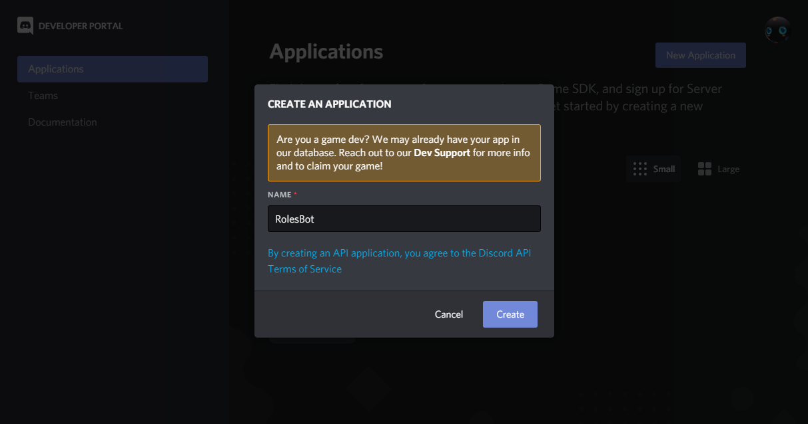
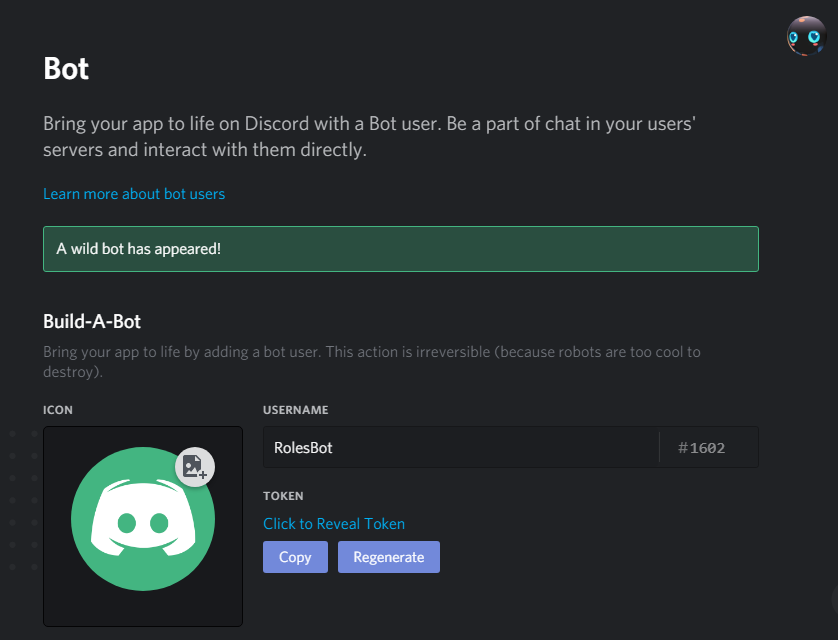
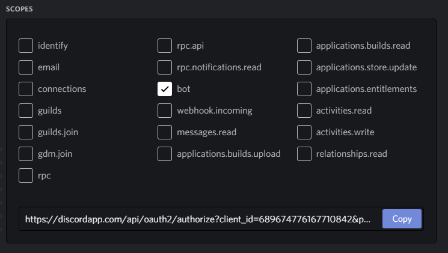

# Discord Role Bot

A very simple bot for mass giving discord members a role based on a list of discord user tags.

# Setup

* Install [NodeJS](https://nodejs.org/en/) and ensure NPM is available to the commandline

* Create a copy of the file bot.json and rename it to bot.prod.json 

* Create a new discord application [here](https://discordapp.com/developers/applications/).



* Navigate to the bots tab and select Add Bot


* Click copy token and paste the token into the token field of the bot.prod.json file



* Set the bot's icon

* Unchecked Public Bot


* To invite bot navigate to the OAuth2 tab, check the bot scope, and then check the permissions:
  * Send Messages

  * Manage Roles
  * Embed Links




* Then copy the invite link into your browser and invite the bot the server

* Ensure that you have created the file `bot.prod.json` and added the token from the bot application page
* Create a file called `user_tags.txt` and add user tag, with each user on its own line, eg
  ```
  UserName1#0001
  UserName2#0002
  UserName3#0003
  ```
* Clone or download this repo and then run  `npm install`
* Build with `npm run build`
* Run `npm start`
* The bot should now be running
* Set the role you want to assign to users with the`/setrole RoleName` command
* The bot will now listen for users joinning the server and automatically assign the role based on the `user_tags` file
* You can set the bot to automatically scan existing server members with the `/giveroles` command or with the `/setinterval n` where n is number of hours
* Run the command `/setintervel 0 * * * *` to set the bot to automically assign the role hourly, run `/setinterval` to cancel the scheduled job.
